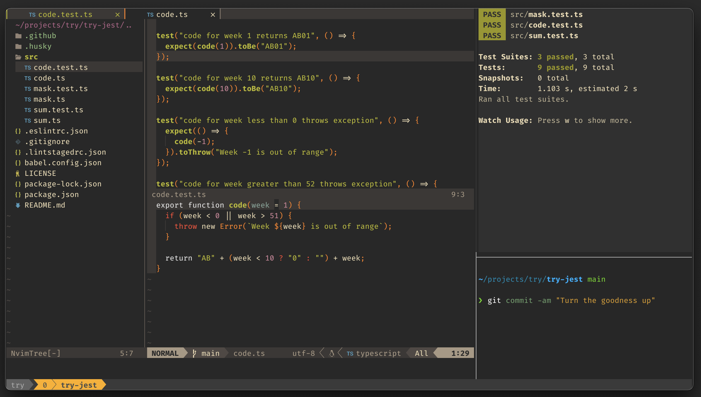

# try-jest

Try Jest

## tl;dr

    npm install
    npm test

## Make changes

### TDD and with a dash of Trunk Based TCR

    npm test:watch

- Write simplest (failing) test that reads like a specification
- Write simplest code to get green
- Commit
  - if test fails then **your code is reverted**
  - if your code was not covered by tests then **your code is reverted**
  - if test passes and commit is OK, then code automatically pushed to origin
  - if you haven't been correcting lint errors in your editor then push will be
    rejected
- Refactor code
- Repeat and create all tests that you can think that should fail for your
  specification

### TDD Katas

Read <http://www.codemanship.co.uk/tdd_jasongorman_codemanship.pdf>

### TCR

As with TDD flow above, but no peaking. When you commit, if change is no good,
you loose the change, but gain wisdom. If all good then straight to remote trunk
to share the goodness.
